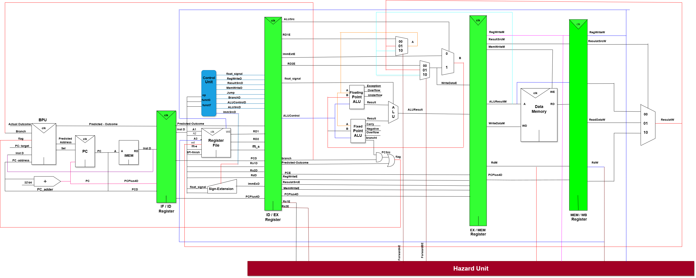
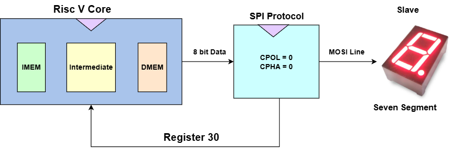
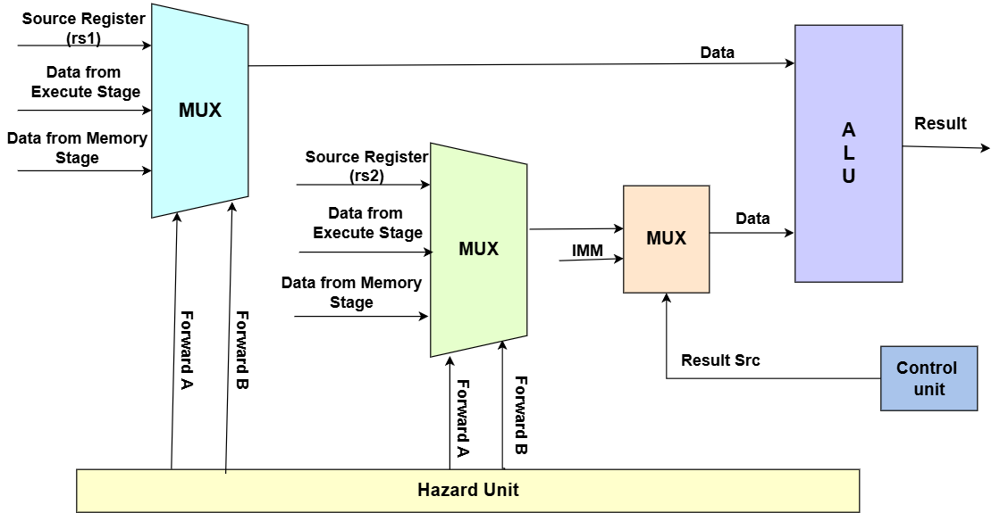

# RISC-V 5‑Stage Pipelined Core (Vivado Project)

  

This repository contains a RISC‑V processor implemented in Verilog with a classic 5‑stage pipeline and integrated SPI master and floating‑point support.

## Features
- 5‑stage pipeline: Fetch, Decode, Execute, Memory, Writeback
- Hazard detection and data forwarding (see `hazard_unit.v`)
- Integrated SPI master in Memory stage (`spimodule.v`, `spi2.v`), with finish flag passed into the front‑end for flow control
- Floating‑point operations via `ALU_Floating_Point` with multiplication, division, add/sub, and iteration unit
- FFT co‑processor handshake exposed via register file interface (see below)
- Top module `TOP_RISC_V` ties the pipeline together
- Testbench `tb.v`
- Constraints example `dd.xdc`

## Top‑level
- Top module: `TOP_RISC_V` in `modified risc v.srcs/sources_1/new/riscv.v`
- Note: SPI ports exist in the Memory stage. Ensure top‑level SPI ports are exposed (uncomment in `TOP_RISC_V`) if you plan to drive external SPI pins:
  - `i_SPI_MISO`, `o_SPI_MOSI`, `o_SPI_Clk`, `o_SPI_CS_n`

## Directory Layout
- RTL: `modified risc v.srcs/sources_1/new/*.v`
- Testbench: `modified risc v.srcs/sim_1/new/tb.v`
- Constraints: `modified risc v.srcs/constrs_1/new/dd.xdc`

## Build & Simulate (Vivado)
1. Create/clone the Vivado project or add the RTL files to a new project.
2. Set `TOP_RISC_V` as top (simulation top is `top_pipe_line_tb` in `tb.v`).
3. Run behavioral simulation. The design uses forwarding and branch logic in `execute_cycle.v` and `hazard_unit.v`.
4. Synthesis/implementation target depends on your FPGA; update `dd.xdc` as needed for board pins.

## SPI Integration
- SPI master provided by `SPI_Master` and `SPI_Master_With_Single_CS` (`spi2.v` and `spimodule.v`).
- Memory stage (`memory_cycle.v`) connects the SPI signals and exposes a `spi_finish` handshake back to the front‑end (`fetchdecodetop.v`).

### Additional Diagrams

  

  

## Floating‑Point
- `ALU_Floating_Point` in `ALU float.v` supports add/sub, multiply, divide, and an iteration block.
- Integrated in `ALU_TOP` and selected by `float_signal` from decode.

## FFT Co‑Processor Interface
- The register file (`reg1.v`) exposes two signals to integrate an external FFT co‑processor:
  - `fft_s` (output): intended “FFT start” request.
  - `fft_e` (input): “FFT end” acknowledgment from the FFT block.
- Current semantics in `reg1.v`:
  - When `fft_e` is asserted (co‑processor done), the register file writes `1` to register `x2` to signal completion.
  - The code shows an example (commented) way to drive `fft_s` high when `x1 == 1`. Tie `fft_s` to your chosen start condition (e.g., write `1` to `x1`).
- This simple handshake lets software start an FFT via a register write and detect completion by polling `x2`.

## Hazard Unit
- Implemented in `hazard_unit.v`.
- Provides data forwarding for Execute‑stage sources `Rs1_E`/`Rs2_E` from:
  - Memory stage result when `RegWriteM == 1` and `RD_M` matches source → forward select `2'b10`.
  - Writeback stage result when `RegWriteW == 1` and `RD_W` matches source → forward select `2'b01`.
- On reset, forwarding selects default to `2'b00`.
- Note: The provided hazard unit focuses on forwarding. If you add an FFT or other long‑latency co‑processor, manage start/done handshakes (e.g., via `fft_s`/`fft_e`) and consider inserting stalls if your co‑processor introduces multi‑cycle latency on register dependencies not covered by forwarding.

## Notes
- The Vivado project artifacts (.runs/.sim/.gen, etc.) are intentionally excluded via `.gitignore`. Only source RTL, testbench, and constraints are tracked.
